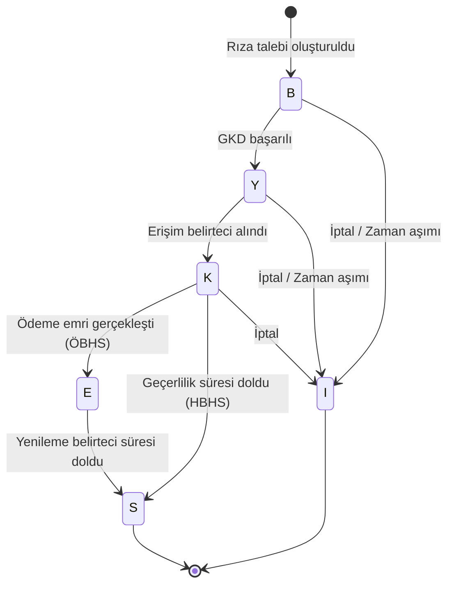

# RR-001 | Mevzuat Araştırması (Regulatory Research)

## Açık Bankacılık Rıza Yönetim Sistemi

---

| Alan | Bilgi |
|------|-------|
| **Belge ID** | RR-001 |
| **Belge Adı** | Mevzuat Araştırması |
| **İlişkili Belgeler** | PC-001, SA-001, RM-001 |
| **Hazırlayan** | Erkut Laçin — Business Analyst |
| **Hazırlanma Tarihi** | 24 Temmuz 2026 |
| **Versiyon** | 1.0 |
| **Durum** | Taslak — Hukuk Onayı Bekliyor |

---

## Revizyon Geçmişi

| Versiyon | Tarih | Hazırlayan | Açıklama |
|----------|-------|-----------|----------|
| 1.0 | 24 Temmuz 2026 | Erkut Laçin | İlk yayın |

---

## 1. Amaç ve Kaynaklar

Bu belge, projenin dayandığı üç düzenleme çerçevesini özetler:

1. **BDDK — ÖHVPS (Ödeme Hizmeti Veri Paylaşım Servisleri) API İlke ve Kuralları v2.0** — proje dosyaları arasında yer alan resmi teknik standart dokümanı
2. **KVKK (6698 Sayılı Kişisel Verilerin Korunması Kanunu)** — rıza ve veri işleme süreçlerinin hukuki temeli

---

## 2. BDDK — ÖHVPS API İlke ve Kuralları (v2.0)

### 2.1 Temel Roller

| Kısaltma | Açık Adı | Rolü |
|----------|----------|------|
| **ÖHK** | Ödeme Hizmeti Kullanıcısı | Son kullanıcı / müşteri |
| **HHS** | Hesap Hizmeti Sağlayıcısı | Müşterinin hesabını tutan kurum (bu projede: Portföy Bankası) |
| **YÖS** | Yetkilendirilmiş Ödeme Servis Sağlayıcısı | Rıza ile hesap/ödeme verisine erişen üçüncü taraf (genel terim) |
| **HBHS** | Hesap Bilgisi Hizmeti Sağlayıcısı | Yalnızca hesap bilgisine erişen YÖS alt tipi |
| **ÖBHS** | Ödeme Başlatma Hizmeti Sağlayıcısı | Ödeme emri başlatan YÖS alt tipi |
| **GKD** | Güçlü Kimlik Doğrulama | Çok faktörlü kimlik doğrulama süreci |

### 2.2 Rıza Durumları (Consent State Machine)

Bu, projenin **Consent Lifecycle** dokümanının doğrudan temelini oluşturacak en kritik bölümdür. ÖHVPS, rızanın alabileceği durumları tek harfli kodlarla tanımlar:

| Kod | Durum | Ne Zaman Oluşur |
|-----|-------|------------------|
| **B** | Yetki Bekleniyor | İlk rıza talebi oluşturulduğunda |
| **Y** | Yetkilendirildi | GKD başarıyla tamamlandığında |
| **K** | Yetki Kullanıldı | Erişim belirteci (access token) alındığında |
| **E** | Yetki Ödeme Emrine Dönüştü | Yalnızca ÖBHS (ödeme) akışında, ödeme emri gerçekleştiğinde |
| **S** | Yetki Sonlandırıldı | Erişim geçerlilik süresi dolduğunda (HBHS) veya yenileme belirteci süresi dolduğunda (ÖBHS) |
| **I** | Yetki İptal | Kullanıcı, sistem veya zaman aşımı kaynaklı iptal durumunda |

**Durum geçiş kuralı örnekleri:**
- `B → Y`: GKD başarılı tamamlandığında
- `Y → K`: Erişim belirteci alındığında
- `K → E`: Ödeme emri gerçekleştiğinde (yalnızca ödeme akışı)
- `K → S`: Erişimin geçerli olduğu son tarih geldiğinde
- `B/Y/K → I`: İptal senaryolarından biri gerçekleştiğinde (aşağıya bakınız)

### 2.3 Rıza İptal Detay Kodları

Rıza `I` (Yetki İptal) durumuna geçtiğinde, **neden** iptal edildiğini ayrıca kodlayan bir detay alanı zorunludur. Bu detay kodları, ileride Test Case'lerin (negatif senaryo testleri) doğrudan kaynağı olacaktır:

| Kod | Anlamı |
|-----|--------|
| 01 | Yeni rıza talebi ile iptal |
| 02 | Kullanıcı isteği ile HHS üzerinden iptal |
| 03 | Kullanıcı isteği ile YÖS üzerinden iptal |
| 04 | Süre aşımı — Yetki Bekleniyor (5 dakika) |
| 05 | Süre aşımı — Yetkilendirildi (5 dakika) |
| 06 | Süre aşımı — Yetki Ödemeye Dönüşmedi |
| 07 | GKD iptali — Aynı rıza no ile mükerrer çağrım |
| 08 | GKD iptali — Rıza no ile kimlik bilgisi uyuşmazlığı |
| 09 | GKD iptali — Uygun hesap/kart ürünü bulunmuyor |
| 10 | GKD iptali — Açık bankacılık kanalı kapalı |
| 11 | GKD iptali — Hesap/kart yetki sorunu |
| 12 | GKD iptali — ÖHK, HHS kontrollerini geçemedi |
| 13 | GKD iptali — ÖHK isteğiyle vazgeçildi |
| 14 | GKD iptali — Fraud şüphesi |
| 99 | Diğer |

### 2.4 Temel İş Kuralları (BRD'ye Doğrudan Girdi Olacak)

1. **Tekillik kuralı (Hesap Bilgisi Rızası):** Bir ÖHK'nın, bir YÖS için, bir HHS'de aynı anda yalnızca **B, Y veya K** durumunda tek bir rızası olabilir. Ancak aynı kişi hem bireysel hem kurumsal kullanıcı ise, iki rıza türü paralel var olabilir.
2. **Tekillik kuralı (Ödeme Emri Rızası):** Bu kısıt geçerli değildir — bir ÖHK'nın bir YÖS için bir HHS'de istediği kadar ödeme rızası olabilir.
3. **Zaman aşımı kuralı:** `Yetki Bekleniyor` durumunda 5 dakikadan uzun kalan kayıtlar otomatik olarak iptal edilir (kod 04).
4. **Rıza güncellenemez:** Kullanıcı hesap/izin/tarih bilgilerini değiştirmek isterse, önce mevcut rıza iptal edilip yeniden GKD ile yeni rıza alınmalıdır. Doğrudan güncelleme desteklenmez.
5. **Hesap/kart kapanması rızayı geçersiz kılmaz:** Kullanıcı proaktif olarak rızasını iptal etmediği sürece, kapanan hesap/kart bilgisi diğer çevrimiçi kanallarla tutarlı şekilde yönetilir.
6. **TLS zorunluluğu:** HHS-YÖS bağlantısı uçtan uca en az **TLS 1.2** ile şifrelenmelidir.
7. **Zaman damgası standardı:** Zaman damgaları 5070 sayılı Elektronik İmza Kanunu kapsamındaki zaman damgası tanımına dayanmalıdır.
8. **Ayrık GKD zorunluluğu:** Mobil uygulaması olan HHS'ler için Ayrık (decoupled) GKD desteği zorunludur; yalnızca web kanalı olan HHS'ler bu akıştan muaftır.

### 2.5 Kritik Hata Kodları (Örnek Set)

| Hata Kodu | Anlamı |
|-----------|--------|
| `TR.OHVPS.Resource.ConsentRevoked` | Rıza iptal edilmiş veya sonlandırılmış |
| `TR.OHVPS.Resource.ConsentMismatch` | Rıza durumu, işlemle uyumsuz |
| `TR.OHVPS.Business.ConsentAlreadyExists` | Kullanıcının zaten aktif bir rızası var |
| `TR.OHVPS.Connection.InvalidToken` | Erişim/yenileme belirteci geçersiz |
| `TR.OHVPS.Business.CustomerNotFound` | Kullanıcı HHS'de bulunamadı |
| `TR.OHVPS.Business.OpenBankingChannelClosed` | Kullanıcının açık bankacılık kanalı kapalı |

> Bu tablo örnek/temsili bir kesittir; API tasarım fazında (Faz 3) OpenAPI spesifikasyonuna tüm hata kodları eksiksiz aktarılacaktır.

---

## 3. KVKK — Genel Çerçeve (Doğrulama Gerektirir)

KVKK'nın bu proje için ilgili olduğu düşünülen genel maddeleri:

| Madde/Kavram | Bu Projeyle İlişkisi |
|--------------|----------------------|
| Madde 10 — Aydınlatma Yükümlülüğü | Rıza ekranında ÖHK'ya hangi verinin, hangi amaçla, ne kadar süreyle paylaşılacağının açıkça belirtilmesi |
| Madde 11 — İlgili Kişinin Hakları | Kullanıcının rızasını görme, iptal etme ve verisinin işlenip işlenmediğini sorgulama hakkı |
| Açık Rıza Şartları | Rızanın özgür iradeyle, belirli bir konuya ilişkin ve bilgilendirmeye dayalı olması |

> **⚠️ Doğrulama Gerekli:** Bu bölümdeki KVKK yorumları genel/kamuya açık bilgiye dayanmaktadır ve **resmi hukuki görüş değildir**. RM-001'de LGL (Baş Hukuk Danışmanı) bu bölümün "Accountable" tarafıdır — BRD yazılmadan önce bu içeriğin doğrulanması gerekir.

---

## 4. Sonraki Belgelerle Bağlantı

| Bu Belgedeki İçerik | Nereye Aktarılacak |
|----------------------|---------------------|
| Rıza Durumları (2.2) | `consent-lifecycle.md` (Faz 4) |
| İş Kuralları (2.4) | `business-rules.md` (Faz 2) |
| Hata Kodları (2.5) | `openapi.yaml` (Faz 3) |
| KVKK maddeleri (3) | `business-requirements.md` — KVKK Aydınlatma Metni gereksinimleri |

---

*Bir sonraki belge: As-Is Process Analysis (AP-001).*