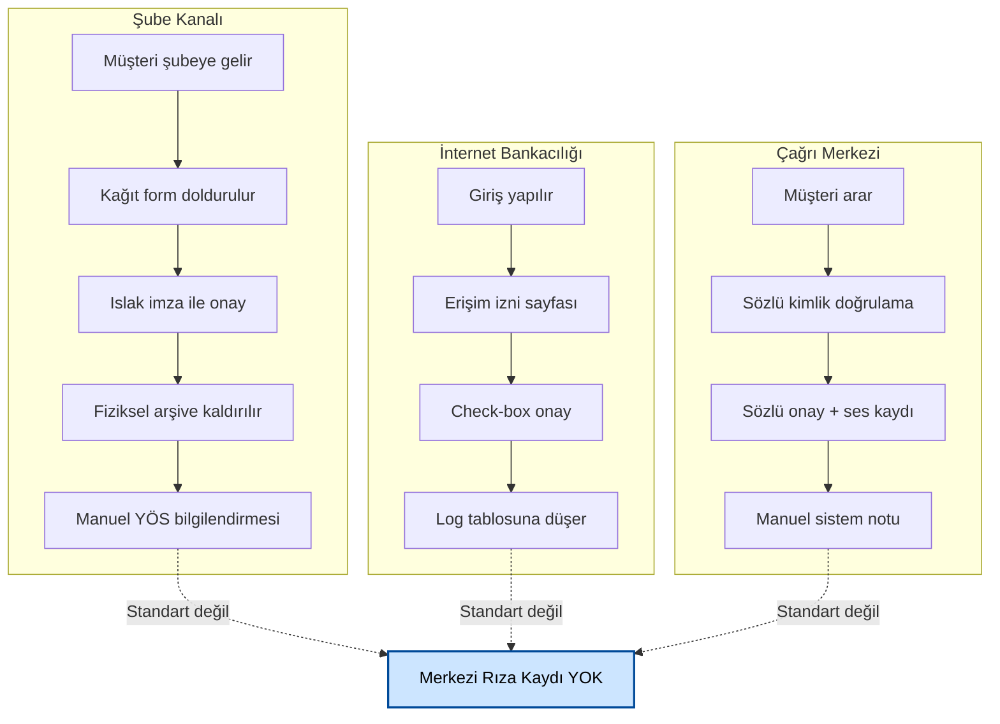

# AP-001 | Mevcut Durum Süreç Analizi (As-Is Process Analysis)

## Açık Bankacılık Rıza Yönetim Sistemi

---

| Alan | Bilgi |
|------|-------|
| **Belge ID** | AP-001 |
| **Belge Adı** | Mevcut Durum Süreç Analizi |
| **İlişkili Belgeler** | PC-001 (Bölüm 2.1), RR-001 |
| **Hazırlayan** | Erkut Laçin — Business Analyst |
| **Hazırlanma Tarihi** | 24 Temmuz 2026 |
| **Versiyon** | 1.0 |
| **Durum** | Taslak |

---

## Revizyon Geçmişi

| Versiyon | Tarih | Hazırlayan | Açıklama |
|----------|-------|-----------|----------|
| 1.0 | 24 Temmuz 2026 | Erkut Laçin | İlk yayın |

---

## 1. Amaç

Bu belge, Portföy Bankası A.Ş.'nin açık bankacılık rıza yönetim sistemi kurulmadan önceki **mevcut (kurgusal) süreçlerini** üç kanal bazında tanımlar: şube, internet bankacılığı, çağrı merkezi. Amaç, PC-001'de tanımlanan problemlerin süreç seviyesinde nerede ve nasıl ortaya çıktığını somutlaştırmaktır.

> **Not:** Aşağıdaki süreçler, gerçek bir kuruma ait olmayıp yalnızca ÖHVPS öncesi tipik bankacılık uygulamalarını temsil eden kurgusal senaryolardır.

---

## 2. Kanal Bazlı Mevcut Süreçler

### 2.1 Şube Kanalı

| Adım | Açıklama | Sorumlu |
|------|----------|---------|
| 1 | Müşteri şubeye gelir, açık bankacılık hizmeti talep eder | ÖHK |
| 2 | Şube temsilcisi kağıt rıza formu doldurur | Şube Temsilcisi |
| 3 | Müşteri formu ıslak imza ile onaylar | ÖHK |
| 4 | Form, fiziksel arşive kaldırılır | Şube Temsilcisi |
| 5 | Şube, ilgili YÖS'e manuel bilgilendirme yapar (e-posta/telefon) | Şube Temsilcisi |

**Tespit edilen sorunlar:**
- Rıza kaydı dijital sistemde tutulmuyor → arama/erişim manuel arşiv taramasını gerektiriyor
- Rızanın hangi hesap/kart için, hangi tarihe kadar geçerli olduğu standart bir formatta değil
- YÖS'e bilgilendirme otomatik değil → gecikme riski

### 2.2 İnternet Bankacılığı Kanalı

| Adım | Açıklama | Sorumlu |
|------|----------|---------|
| 1 | Müşteri internet bankacılığına giriş yapar | ÖHK |
| 2 | "Üçüncü Taraf Erişim İzni" sayfasına yönlendirilir | Sistem |
| 3 | Müşteri check-box ile onay verir (tek tık, detay seçimi yok) | ÖHK |
| 4 | Onay, sistem log tablosuna düşer (ancak yapılandırılmış rıza nesnesi değildir) | Sistem |
| 5 | Müşteri rızasını sonradan görüntüleyemez veya iptal edemez | — |

**Tespit edilen sorunlar:**
- Rıza, hesap/kart bazında değil "tümü ya da hiçbiri" mantığıyla veriliyor
- Rıza geçmişi kullanıcı arayüzünde görünmüyor (KVKK Madde 11 — görüntüleme hakkı karşılanamıyor)
- Log kaydı, ÖHVPS'nin beklediği yapılandırılmış rıza durumu (B/Y/K/E/S/I) ile uyumlu değil

### 2.3 Çağrı Merkezi Kanalı

| Adım | Açıklama | Sorumlu |
|------|----------|---------|
| 1 | Müşteri çağrı merkezini arar, sözlü talep iletir | ÖHK |
| 2 | Temsilci kimlik doğrulama sorularıyla müşteriyi doğrular | Çağrı Merkezi Temsilcisi |
| 3 | Müşteri sözlü onay verir, görüşme kaydedilir | ÖHK |
| 4 | Temsilci, sistem üzerinde manuel not girer | Çağrı Merkezi Temsilcisi |
| 5 | Ses kaydı, ayrı bir arşiv sisteminde saklanır (rıza kanıtı olarak) | Sistem |

**Tespit edilen sorunlar:**
- Rıza kanıtı, aranabilir/yapılandırılmış veri değil, ses kaydı — BDDK denetiminde hızlı sunulması zor
- GKD (Güçlü Kimlik Doğrulama) standardına uygun bir kimlik doğrulama yapılmıyor, temsilci inisiyatifine dayalı sorular kullanılıyor

---

## 3. Ortak Sorun Alanları (Kanal Bağımsız)

| # | Sorun | İlişkili ÖHVPS/KVKK Referansı |
|---|-------|-------------------------------|
| S-01 | Rıza durumları (B/Y/K/E/S/I) hiçbir kanalda sistematik olarak takip edilmiyor | RR-001, Bölüm 2.2 |
| S-02 | GKD standardına uygun kimlik doğrulama hiçbir kanalda tam uygulanmıyor | RR-001, Bölüm 2.4, Madde 8 |
| S-03 | Rıza iptali süreci standart değil, kanal bazında farklılaşıyor | RR-001, Bölüm 2.3 (İptal Detay Kodları) |
| S-04 | Aydınlatma metni içerikleri kanallar arasında tutarsız | RR-001, Bölüm 3 (KVKK Madde 10) |
| S-05 | Rıza verisi, API üzerinden YÖS'lere sunulamıyor | ÖHVPS'nin temel gerekliliği |

---

## 4. Mevcut Süreç Akış Şeması (Üst Düzey)

---

## 5. Sonraki Adıma Bağlantı

Bu belgedeki üç kanal ve 5 ortak sorun (S-01 – S-05) iki yöne bağlanır:

1. **Consent Lifecycle (CL-001):** Bu belgede tespit edilen "rıza durumlarının sistematik takip edilmemesi" sorunu (S-01), Faz 2'nin bir sonraki belgesi olan Consent Lifecycle'da ÖHVPS'nin resmi durum makinesiyle karşılaştırılarak somutlaştırılmıştır.
2. **Business Requirements Document (BR-001):** Her sorun (S-01 – S-05), Faz 3'te hazırlanan BRD'de en az bir fonksiyonel gereksinimle eşleştirilmiştir (bkz. BR-001, Bölüm 5 — Gereksinim → Sorun İzlenebilirlik Özeti). Bu eşleştirme ilerleyen Faz 4'teki Requirements Traceability Matrix'in (RTM) temelini oluşturacaktır.

---

*Bir sonraki belge: Consent Lifecycle (CL-001).*