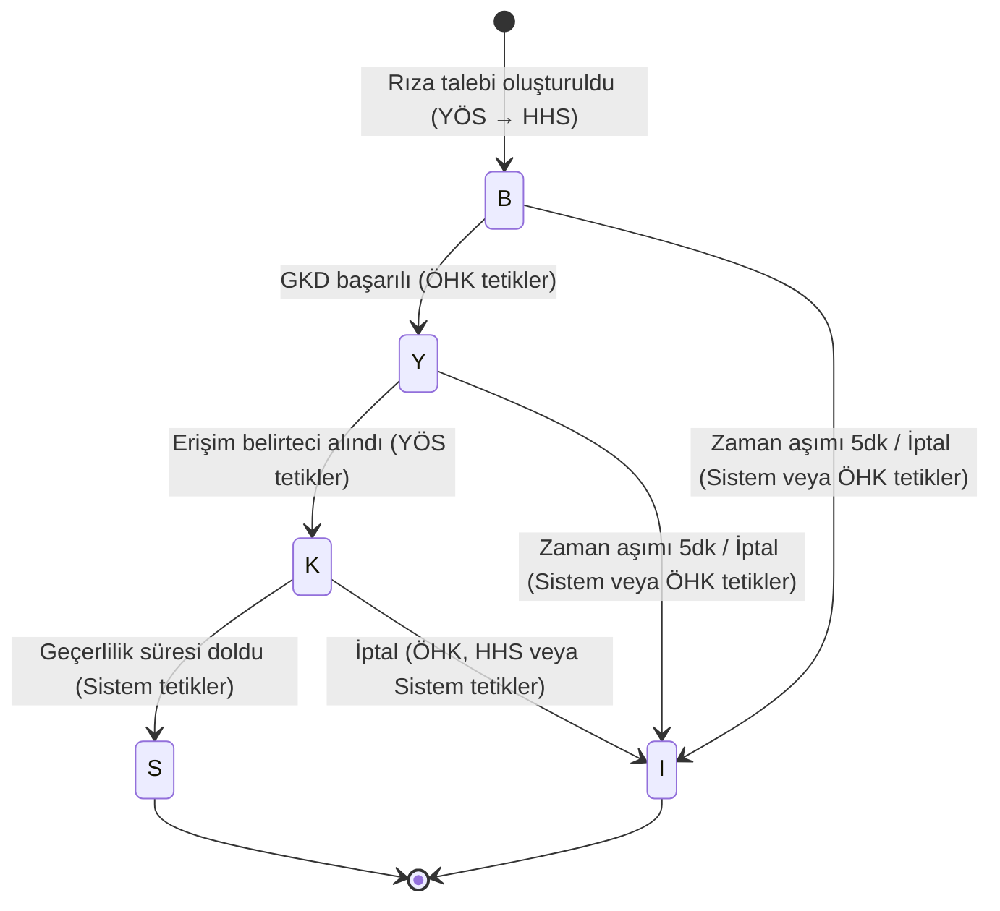
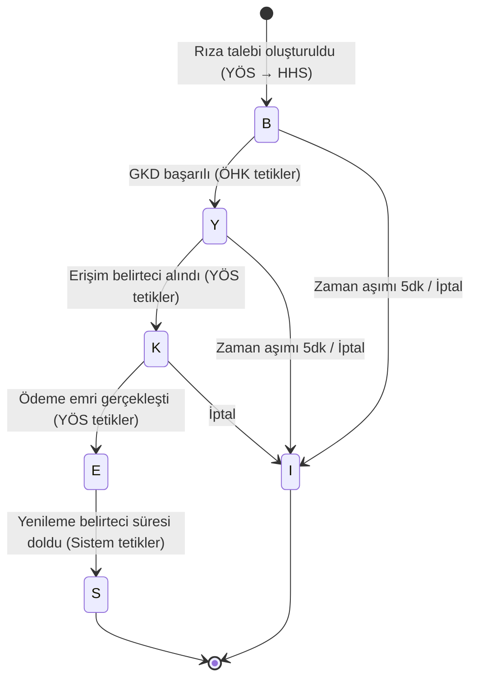

# CL-001 | Rıza Yaşam Döngüsü (Consent Lifecycle)

## Açık Bankacılık Rıza Yönetim Sistemi

---

| Alan | Bilgi |
|------|-------|
| **Belge ID** | CL-001 |
| **Belge Adı** | Rıza Yaşam Döngüsü |
| **İlişkili Belgeler** | RR-001 (§2.2, §2.3), BR-001 (FR-011–FR-014, FR-018–FR-021), GL-001 |
| **Hazırlayan** | Erkut Laçin — Business Analyst |
| **Hazırlanma Tarihi** | 24 Temmuz 2026 |
| **Versiyon** | 1.0 |
| **Durum** | Taslak |

---

## Revizyon Geçmişi

| Versiyon | Tarih | Hazırlayan | Açıklama |
|----------|-------|-----------|----------|
| 1.0 | - | Erkut Laçin | İlk yayın |

---

## 1. Amaç

RR-001, ÖHVPS'nin rıza durum makinesini ham mevzuat diliyle özetler. Bu belge, aynı durum makinesini **iş analizi perspektifiyle** yeniden ele alır: her geçişi tetikleyen aktörü, oluşan audit log kaydını ve karşılık geldiği BRD gereksinimini netleştirir. Ayrıca RR-001'in aksine, **HBH ve ÖEBH akışlarını ayrı diyagramlarla** ele alır — çünkü `E` durumu yalnızca ÖEBH'de vardır ve bu ayrım, To-Be süreç tasarımında karışıklığı önler.

---

## 2. Hesap Bilgisi Rızası (HBH) Yaşam Döngüsü

### 2.1 Geçiş Detay Tablosu (HBH)

| Geçiş | Tetikleyen Aktör | İlişkili FR | Audit Log Kaydı |
|-------|-------------------|-------------|-------------------|
| `[*] → B` | YÖS (API çağrısı) | FR-001 | "Rıza talebi oluşturuldu" — zaman damgası, YÖS ID, talep edilen kapsam |
| `B → Y` | ÖHK (GKD tamamlama) | FR-011 | "GKD başarılı" — zaman damgası, kullanılan GKD yöntemi |
| `B → I` | Sistem (zaman aşımı) veya ÖHK (vazgeçme) | FR-013 | "İptal — kod 04 veya 13" |
| `Y → K` | YÖS (erişim belirteci talebi) | — | "Erişim belirteci alındı" — zaman damgası |
| `Y → I` | Sistem (zaman aşımı) | FR-014 | "İptal — kod 05" |
| `K → S` | Sistem (geçerlilik süresi kontrolü) | — | "Yetki sonlandırıldı" — zaman damgası |
| `K → I` | ÖHK (self-servis iptal) veya HHS (manuel) | FR-018 | "İptal — kod 02 veya 03" |

---

## 3. Ödeme Emri Başlatma Rızası (ÖEBH) Yaşam Döngüsü

### 3.1 Geçiş Detay Tablosu (ÖEBH — yalnızca HBH'den farklı olanlar)

| Geçiş | Tetikleyen Aktör | İlişkili FR | Audit Log Kaydı |
|-------|-------------------|-------------|-------------------|
| `K → E` | YÖS (ödeme emri API çağrısı) | FR-008 | "Ödeme emri gerçekleşti" — zaman damgası, işlem referansı, tutar |
| `E → S` | Sistem (yenileme belirteci süre kontrolü) | — | "Yetki sonlandırıldı (ödeme sonrası)" |

> Diğer tüm geçişler (B→Y, B→I, Y→K, Y→I, K→I) HBH ile aynı mantığı izler; Bölüm 2.1'e bakınız.

---

## 4. HBH vs ÖEBH Karşılaştırması

| Boyut | HBH | ÖEBH |
|-------|-----|------|
| Tekillik kuralı | Aynı YÖS+HHS için tek aktif rıza | Kısıt yok, çoklu eşzamanlı rıza mümkün |
| `E` durumu | Yok | Var — ödeme gerçekleştiğinde |
| Rıza kapsamı | Hesap/veri türü bazlı | Tutar/alıcı/amaç bazlı |
| Yenileme belirteci | Kullanılmaz | Kullanılır (`E → S` geçişinde) |

---

## 5. Zaman Sınırları Özeti

| Durum | Azami Süre | Süre Aşılırsa |
|-------|-----------|----------------|
| `B` (Yetki Bekleniyor) | 5 dakika | Otomatik `I`, kod 04 |
| `Y` (Yetkilendirildi) | 5 dakika | Otomatik `I`, kod 05 |
| `K` (Yetki Kullanıldı) | HHS'nin belirlediği geçerlilik süresi | Otomatik `S` |

---

## 6. Sonraki Belgeyle Bağlantı

Bu belgedeki iki durum makinesi, **To-Be Process (BPMN)** dokümanının omurgasını oluşturacaktır — özellikle GKD adımı ve iptal/zaman aşımı dallanmaları, BPMN'deki gateway'lere doğrudan karşılık gelecektir.

