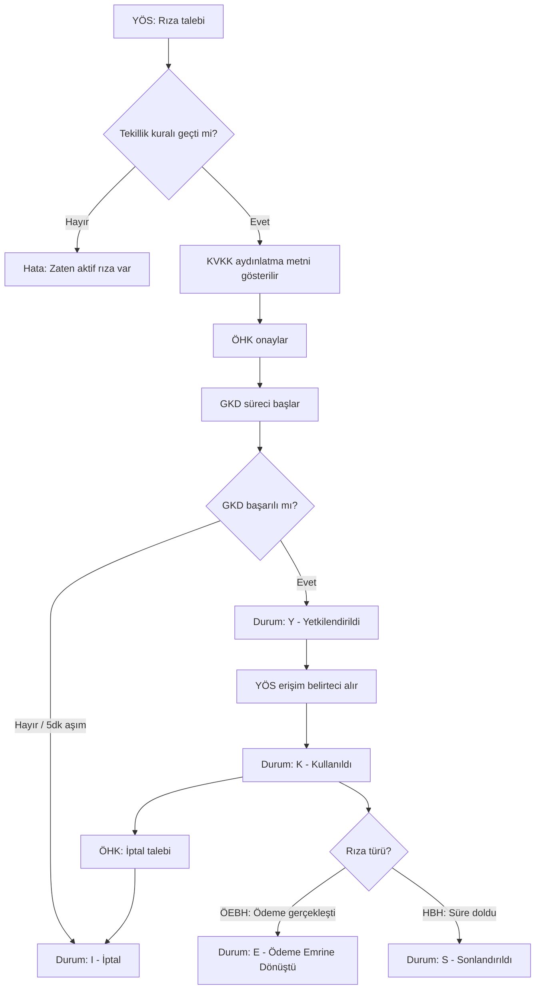

# TB-001 | Hedef Süreç Tasarımı (To-Be Process)

## Açık Bankacılık Rıza Yönetim Sistemi

---

| Alan | Bilgi |
|------|-------|
| **Belge ID** | TB-001 |
| **Belge Adı** | Hedef Süreç Tasarımı (To-Be Process) |
| **İlişkili Belgeler** | AP-001, CL-001, BR-001 |
| **Hazırlayan** | Erkut Laçin — Business Analyst |
| **Hazırlanma Tarihi** | 24 Temmuz 2026 |
| **Versiyon** | 1.0 |
| **Durum** | Taslak |

---

## Revizyon Geçmişi

| Versiyon | Tarih | Hazırlayan | Açıklama |
|----------|-------|-----------|----------|
| 1.0 | 24 Temmuz 2026 | Erkut Laçin | İlk yayın |

---

## 1. Amaç

Bu belge, AP-001'de tespit edilen 3 kopuk kanalın (şube, internet bankacılığı, çağrı merkezi) yerine geçecek **tek, birleşik ve dijital** rıza sürecini tanımlar. Süreç, CL-001'deki durum makinesini (B→Y→K→E/S/I) somut adımlara ve sistem bileşenlerine oturtur.

---

## 2. Kapsam ve Yaklaşım

To-Be süreç, hem **HBH** hem **ÖEBH** rızaları için ortak bir akış izler; yalnızca YÖS'ün API çağrısındaki rıza türü parametresi ve CL-001'de tanımlanan `K→E` geçişi (yalnızca ÖEBH) farklılaşır. Bu nedenle tek bir birleşik BPMN akışı yeterlidir — iki ayrı süreç şeması gerekmez.

**Kanal stratejisi:** Şube ve çağrı merkezi kanalları **tamamen kaldırılmaz** ama rıza alma işlevi bu kanallardan çıkarılıp mobil/internet bankacılığına yönlendirilir. Şube/çağrı merkezi temsilcisi artık rıza formu doldurmaz, müşteriyi dijital kanala yönlendirir (FR-001, FR-005 gereği rıza talebi API üzerinden başlamalıdır).

---

## 3. Aktörler / Swimlane'ler

| Swimlane | Rol |
|----------|-----|
| **ÖHK** | Rızayı veren/yöneten son kullanıcı |
| **YÖS** | Rıza talebini başlatan, erişim belirteci alan dış sistem |
| **HHS Sistemi (Portföy Bankası)** | Rıza kaydını oluşturan, durum makinesini yöneten çekirdek sistem |
| **GKD Servisi** | Kimlik doğrulama işlemini yürüten bileşen |

---

## 4. To-Be Süreç Akışı — Adım Adım

| # | Adım | Aktör | CL-001 Karşılığı | İlişkili FR |
|---|------|-------|--------------------|-------------|
| 1 | YÖS, ÖHK adına rıza talebi API çağrısı yapar (kapsam: hesap/tutar/amaç bilgisiyle) | YÖS → HHS Sistemi | `[*] → B` | FR-001, FR-005 |
| 2 | Sistem, tekillik kuralını kontrol eder (HBH için tek aktif rıza sınırı) | HHS Sistemi | — | FR-003, FR-007 |
| 3 | Sistem, KVKK aydınlatma metnini ÖHK'ya gösterir | HHS Sistemi → ÖHK | — | FR-025, FR-026 |
| 4 | ÖHK aydınlatma metnini onaylar, GKD sürecine yönlendirilir | ÖHK | — | FR-025 |
| 5 | GKD servisi kimlik doğrulamayı yürütür (mobil için Ayrık GKD) | GKD Servisi ↔ ÖHK | — | FR-011, FR-012 |
| 6a | GKD başarılı → rıza `Y` durumuna geçer | HHS Sistemi | `B → Y` | FR-011 |
| 6b | GKD başarısız / 5dk zaman aşımı → rıza `I` durumuna geçer | HHS Sistemi | `B → I` | FR-013 |
| 7 | YÖS, erişim belirteci talep eder | YÖS → HHS Sistemi | `Y → K` | — |
| 8 | Sistem, her durum geçişini audit log'a yazar | HHS Sistemi | (tüm geçişler) | FR-021 – FR-024 |
| 9a | *(Yalnızca ÖEBH)* YÖS ödeme emrini gerçekleştirir → rıza `E` durumuna geçer | YÖS → HHS Sistemi | `K → E` | FR-008 |
| 9b | *(Yalnızca HBH)* Geçerlilik süresi dolduğunda rıza `S` durumuna geçer | HHS Sistemi (otomatik) | `K → S` | — |
| 10 | ÖHK, istediği an rıza listesini görüntüler, aktif rızayı iptal edebilir | ÖHK → HHS Sistemi | `→ I` | FR-015 – FR-020 |

---

## 5. As-Is Sorunlarının Çözümü

| AP-001 Sorunu | To-Be Çözümü |
|-----------------|----------------|
| S-01: Rıza durumları sistematik takip edilmiyor | Adım 1-9, CL-001'deki durum makinesiyle birebir eşleşiyor; her geçiş sistemsel |
| S-02: GKD standardına uygun kimlik doğrulama yok | Adım 5, merkezi GKD Servisi üzerinden zorunlu hale geliyor |
| S-03: Rıza iptali standart değil | Adım 10, tek bir self-servis iptal akışına indirgeniyor |
| S-04: Aydınlatma metni tutarsız | Adım 3, tüm kanallar için tek, merkezi bir aydınlatma metni kaynağına bağlanıyor |
| S-05: Rıza API üzerinden sunulamıyor | Tüm akış zaten API tabanlı tasarlandı (Adım 1, 7, 9) |

---

## 6. Açık Nokta

Adım 2'deki "tekillik kuralı ihlali" senaryosunda YÖS'e dönecek hata mesajının içeriği (hangi hata kodu, RR-001 §2.5'teki hangi karşılığı) henüz netleşmedi — bu, Faz 5'teki OpenAPI tasarımında kesinleştirilecek.

---

*Bir sonraki belge: Data Flow Diagram (DFD-001) — bu süreçteki veri akışının sistem/aktör bazında haritalanması.*