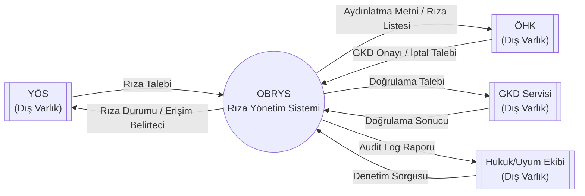
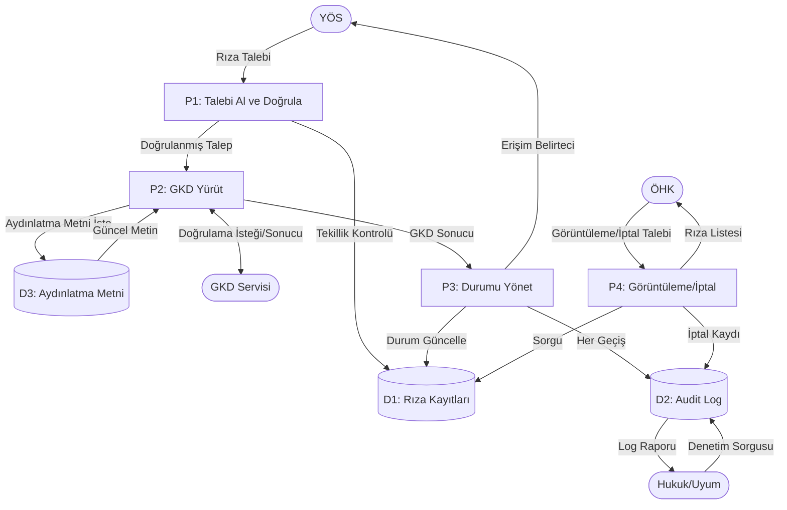

# DFD-001 | Veri Akış Diyagramı (Data Flow Diagram)

## Açık Bankacılık Rıza Yönetim Sistemi

---

| Alan | Bilgi |
|------|-------|
| **Belge ID** | DFD-001 |
| **Belge Adı** | Veri Akış Diyagramı |
| **İlişkili Belgeler** | TB-001, CL-001, BR-001 |
| **Hazırlayan** | Erkut Laçin — Business Analyst |
| **Hazırlanma Tarihi** | 24 Temmuz 2026 |
| **Versiyon** | 1.0 |
| **Durum** | Taslak |

---

## Revizyon Geçmişi

| Versiyon | Tarih | Hazırlayan | Açıklama |
|----------|-------|-----------|----------|
| 1.0 | 24 Temmuz 2026 | Erkut Laçin | İlk yayın |

---

## 1. Amaç

Bu belge, TB-001'deki süreç adımlarını **veri akışı perspektifiyle** yeniden ele alır: hangi veri, hangi dış varlıktan (external entity) hangi işleme (process) girer, hangi veri deposunda (data store) tutulur. Standart DFD notasyonu (Yourdon) kullanılmıştır.

---

## 2. DFD Seviye 0 — Bağlam Diyagramı (Context Diagram)

Sistemi tek bir kara kutu olarak gösterir; yalnızca dış varlıklarla olan veri alışverişini içerir.

---

## 3. DFD Seviye 1 — Ana Süreçler ve Veri Depoları

Sistemin içini 4 ana sürece ve 3 veri deposuna ayırır.

### 3.1 Süreçler (Processes)

| # | Süreç | TB-001 Karşılığı |
|---|-------|---------------------|
| P1 | Rıza Talebini Al ve Doğrula | Adım 1-2 |
| P2 | Kimlik Doğrulama Yürüt (GKD) | Adım 3-6 |
| P3 | Rıza Durumunu Yönet | Adım 7-9 |
| P4 | Rıza Görüntüleme / İptal | Adım 10 |

### 3.2 Veri Depoları (Data Stores)

| # | Veri Deposu | İçerik | Hassasiyet |
|---|--------------|--------|-------------|
| D1 | Rıza Kayıtları (Consent Store) | Rıza ID, durum, kapsam, zaman damgaları | Yüksek (kişisel + finansal veri) |
| D2 | Audit Log Deposu | Tüm durum geçişleri, aktör, zaman damgası | Yüksek (değiştirilemez, KVKK kapsamında) |
| D3 | Aydınlatma Metni Deposu | KVKK aydınlatma metni sürümleri | Düşük (statik içerik) |

### 3.3 Seviye 1 Diyagram

---

## 4. Veri Akışı Detay Tablosu

| Akış | Kaynak → Hedef | Taşınan Veri | İlişkili FR |
|------|------------------|---------------|-------------|
| Rıza Talebi | YÖS → P1 | Hesap/tutar/kapsam bilgisi | FR-001, FR-005 |
| Tekillik Kontrolü | P1 ↔ D1 | Mevcut aktif rıza sorgusu | FR-003, FR-007 |
| GKD Doğrulama | P2 ↔ GKD Servisi | Kimlik doğrulama isteği/sonucu | FR-011, FR-012 |
| Durum Güncelleme | P3 → D1 | Yeni durum kodu (B/Y/K/E/S/I) | CL-001 §2-3 |
| Audit Kaydı | P3, P4 → D2 | Zaman damgası, aktör, geçiş türü | FR-021 – FR-024 |
| Rıza Listesi | D1 → P4 → ÖHK | Aktif/geçmiş rıza kayıtları | FR-015 – FR-017 |
| Denetim Raporu | D2 → Hukuk/Uyum | Filtrelenmiş log kayıtları | FR-024 |

---

## 5. Faz 5'e Bağlantı Notu

D1, D2, D3 veri depoları, Faz 5'te hazırlanacak **Database Schema** dokümanının doğrudan girdisidir. Özellikle D2'nin (Audit Log) "değiştirilemez" (immutable) olması gerekliliği (FR-023), veritabanı tasarımında özel bir kısıt (örn. yalnızca INSERT izni, UPDATE/DELETE yasak) olarak yansıtılmalıdır.

---

*Bu doküman OBRYS-2025 projesine ait veri akış diyagramı belgesidir (Güncelleme tarihi: 24 Temmuz 2026).*
*Bu belgenin tamamlanmasıyla Faz 2 — Süreç Analizi tamamlanmıştır.*
*Bir sonraki belge: Business Rules (BRU-001) — Faz 3'ün ilk belgesi. Bu noktada BR-001 (BRD) de Faz 2 çıktılarına göre gözden geçirilecektir.*